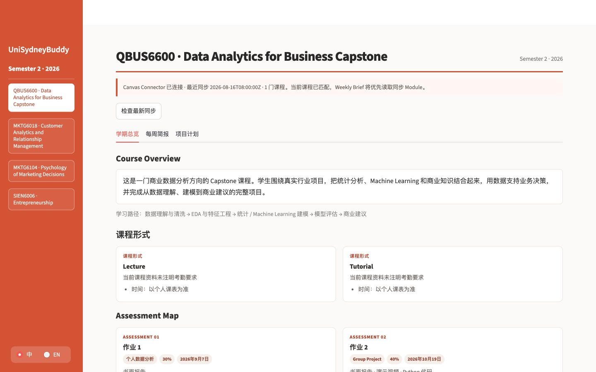
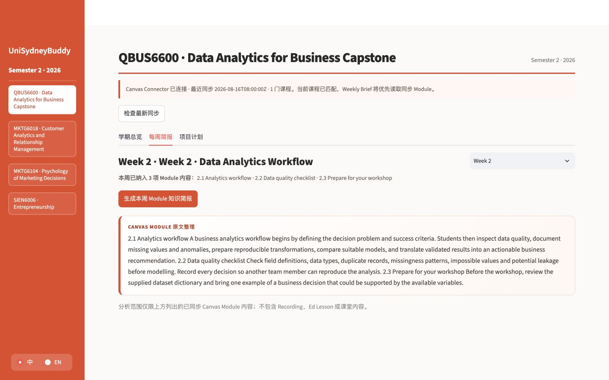
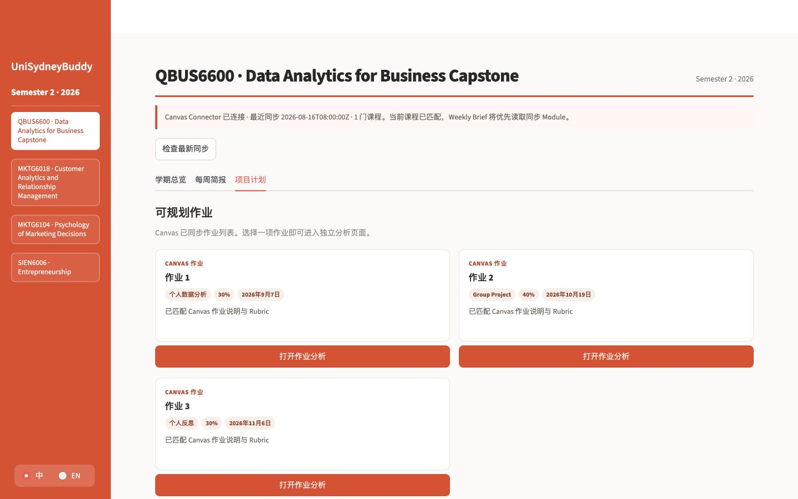

# UniSydneyBuddy Skill Hub

一个面向大学生的中英双语 AI 课程工作台。MVP 将 Canvas 等来源中的课程资料转化为：

1. Semester Brief
2. Weekly Brief
3. Individual / Group Project Plan

开发与 Prompt 调试以中文为主；课程原文和证据保留英文，生成结果可切换中文或英文。

## 当前阶段

当前版本已经完成从课程同步到 AI 解析的核心闭环：

- **Chrome Canvas Connector**：从已登录的 Canvas 会话只读同步 Courses、Modules、Pages、Assignments、Rubrics 与 Announcements，不收集 Canvas 密码。
- **Semester Overview**：整理课程简介、课程形式、Assessment Map、截止日期和 Week 1–13 学习路径。
- **Weekly Brief**：覆盖当周所有已发布 Module items，生成双语 Knowledge Map、逐节讲解、Workshop 准备与一页总结；资料未同步时明确标注，不让 AI 推测。
- **Assignment Analysis**：从 Canvas 作业列表进入独立分析页，提取关键要求、最终交付物和 Assignment Structure。
- **Group Project Planner**：支持 3–6 人 Part / Owner / Reviewer 分工、确认和 Markdown 导出。
- **AI 与数据层**：OpenAI Structured Outputs、课程与用户隔离、SQLite 跨会话持久化、增量更新失效提醒及用户反馈。
- **质量保障**：四门脱敏测试课程、Weekly AI Evaluation、73 项自动测试与真实浏览器验收。

公开仓库中的课程和作业资料均为脱敏或虚构测试内容，不包含个人 Canvas 快照。

## 产品界面

### Semester Overview



### Weekly Brief



### Project Planner



## 数据边界

真实课程材料只能放在 `data/private/`，该目录不会被 Git 跟踪。公开 Demo 使用脱敏或虚构数据。

## 本地验证

```bash
.venv/bin/pytest -q
.venv/bin/python scripts/validate_gold.py
```

## 启动当前原型

```bash
source .venv/bin/activate
streamlit run app.py
```

### 持久保存 OpenAI API Key

复制 `.streamlit/secrets.toml.example` 为 `.streamlit/secrets.toml`，并在本机文件中填写：

```toml
OPENAI_API_KEY = "你的 OpenAI API Key"
```

真实 `secrets.toml` 已被 `.gitignore` 排除，不会上传 GitHub。不要把真实 Key 写入示例文件、代码、聊天或截图。

未配置 `OPENAI_API_KEY` 时，页面只展示 Canvas 事实，不生成假 AI 结果。AI 结果、同步历史和用户反馈保存在被 Git 忽略的 SQLite 文件中；Canvas 原始资料仍保存在独立快照中。连接 Canvas 本身不会触发模型调用。

## Evaluation

四门课程的 Weekly Brief Eval 配置位于 `data/evals/weekly_ai_cases.json`：

```bash
python scripts/run_weekly_ai_evals.py
python scripts/run_weekly_ai_evals.py --live  # 会实际调用已配置的 OpenAI API
```

## 公开部署

`render.yaml` 定义唯一的线上产品路径：Streamlit Web + Canvas Sync API。线上网站生成私人 `sync_id` 地址，浏览器插件将只读快照发送到该地址。部署前在 Render 配置 `OPENAI_API_KEY`，并确认 Sync API 实际域名与插件权限一致。

详细步骤、成本边界和发布检查见 [公开部署说明](./docs/DEPLOYMENT.md)。

学生端产品只保留三个核心模块：Semester Overview、Weekly Brief 和 Project Planner。Semester Overview 使用 Unit Outline 和 Canvas 数据展示 Week 1–13；Weekly Brief 只总结已同步的 Canvas Module，按 Module Summary、关键知识点、详细讲解和内容目录组织；Project Planner 从 Canvas 作业列表进入独立 Assignment Analysis 页面，并支持个人任务和 3–6 人小组规划。

## Canvas Connector

`canvas_connector/` 提供一个只读 Chrome Manifest V3 扩展。它使用浏览器当前已登录的 `canvas.sydney.edu.au` 会话读取用户主动选择的 Courses、Modules、Pages、Assignments 和 Announcements，并把快照发送到本机 `127.0.0.1:8765`。不要求 Canvas 密码或个人 API token。

安装与权限说明见 [`canvas_connector/README.md`](canvas_connector/README.md)。同步数据保存在被 Git 忽略的 `data/local/`；Canvas 同步不等于允许发送资料给 OpenAI。

通知变更和 Eval 不占用学生主界面；Evidence 和自动化 Eval 继续作为内部质量控制。模型使用 Structured Outputs 返回稳定字段，且文档清单只允许出现来源中明确要求或建议的项目。

完整资料：

- [产品文档](./docs/PRODUCT_SPEC_v1.0.md)
- [测试与合理性报告](./docs/TEST_REPORT_v1.0.md)
- [课程数据导入报告](./docs/course-ingestion-report.md)
- [产品反馈记录](./docs/feedback-log.md)
- [历史 PRD v0.1](./UniSydneyBuddy_Skill_Hub_PRD_v0.1.md)
