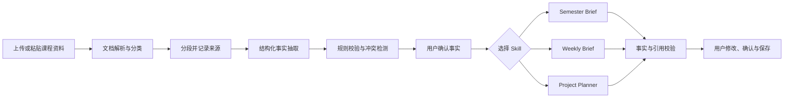

# UniSydneyBuddy Skill Hub — MVP PRD

> 历史文档：本文件保留最初 MVP 设计。当前实现与完整需求请以 [PRODUCT_SPEC_v1.0](./docs/PRODUCT_SPEC_v1.0.md) 为准，测试结论请参见 [TEST_REPORT_v1.0](./docs/TEST_REPORT_v1.0.md)。

- 版本：v0.1
- 日期：2026-08-14
- 产品形态：单用户、本地优先的 AI 课程工作台
- 首要目标：7 天内完成可演示 MVP，用于腾讯 WorkBuddy 生态策略产品经理作品集
- 核心样本：悉尼大学 Semester 2 2026 的真实课程结构
- 产品语言：支持简体中文与英文；开发、产品文档和 Prompt 调试以中文为主

## 1. 产品结论

UniSydneyBuddy Skill Hub 不替代 Canvas，也不做完整 AI Tutor。它把分散在 Canvas Modules、Unit Outline、Recorded Lectures、Ed、Announcements 和 Assignment Brief 中的信息，转换为三层可执行结果：

1. Semester Brief：开学时快速看懂整门课和整个学期。
2. Weekly Brief：每周知道学什么、课前做什么、课后完成什么。
3. Project Planner：把个人或小组作业拆成可执行计划，并持续吸收课程通知带来的变化。

MVP 采用“一个编排器 + 三个受约束 Skill + 一个事实校验器”，不采用复杂多 Agent 自主协作。

Canvas 中已经出现 IgniteAI Search 和课程级 AI assistant 入口，因此本产品不以“问答”作为差异化。核心区别是跨来源建立可确认的课程事实，并进一步生成周行动与个人/团队执行计划。

## 2. 用户问题

### 2.1 开学信息分散

学生需要在 Unit Outline、Canvas Home、Modules、Calendar 和课程通知之间查找：

- Lecture、Workshop/Tutorial 的时间与地点
- 是否考勤
- Assessment 名称、占比、截止日期和形式
- Hurdle、迟交、AI 使用、组队等特殊要求
- 全学期每周主题和重要节点

### 2.2 每周内容缺少统一视图

不同课程的每周材料结构并不一致：

- QBUS6600 按 Week 划分，并包含 Learn、Explore、Reflect、Engage 等环节。
- MKTG6104 同一周中包含主内容、补充阅读、Key Takeaways 和 Online Activity。
- 部分数据课还会把练习放在 Ed Lesson。
- Lecture recording、slides、transcript、workshop preparation 可能位于不同入口。

学生需要的是“这周的行动 Brief”，而不是另一套文件列表。

### 2.3 小组 Project 不能用普通 To-do 表达

真实课程中的小组作业可能包含：

- 前序个人作业向小组作业提供输入
- 3–4 人组队和注册截止时间
- Team responsibilities outline
- Progress report
- Written report
- Presentation video
- Python code 或其他附件
- Peer review
- 保密协议、行业数据和 AI 使用限制

因此 Planner 必须管理交付物依赖、成员责任、共同检查点和个人责任，而非仅生成任务清单。

## 3. 目标与非目标

### 3.1 MVP 目标

- 使用一门真实课程资料，在 10 分钟内生成可核对的 Semester Brief。
- 使用某一周的课程材料，在 3 分钟内生成可执行 Weekly Brief。
- 识别 Assignment 属于个人还是小组，并生成对应计划。
- 每一项关键事实都能回到来源文件或页面。
- AI 不确定时明确标记，不自行补全课程事实。
- 用户可以修改和确认结果；确认后的结构化数据成为后续 Skill 的唯一事实源。

### 3.2 非目标

- 不自动登录或抓取 Canvas、Ed、邮箱。
- 不自动提交作业、发送邮件或修改 Calendar。
- 不做 Quiz、Flashcard、AI Tutor 或论文代写。
- 不做多用户、权限系统、Skill 市场或创作者生态。
- 不在 MVP 中覆盖所有学校和所有课程模板。
- 不处理受保密协议保护的行业数据正文。
- 不复制已有的课程搜索或通用课程问答功能。

## 4. 目标用户与核心场景

### 4.1 目标用户

第一阶段仅服务一类用户：同时修读多门 Canvas 课程、需要 Lecture 与 Workshop/Tutorial 协同安排、并参与个人和小组 Assessment 的悉尼大学学生。

### 4.2 核心 Job to Be Done

- 开学时：帮我在短时间内看懂这门课如何运转。
- 每周开始时：告诉我本周需要理解、准备和完成什么。
- 收到 Assignment 时：告诉我交什么、何时交、如何拆解。
- 组队后：让团队看见谁负责什么、依赖谁、何时共同检查。
- 收到通知时：告诉我它改变了哪一个既有计划。

## 5. 产品信息架构

### 5.0 双语呈现规则

- 用户可在全局切换中文或英文界面，默认中文。
- 原始课程名称、Assessment 名称、教师要求和引用保留英文原文，避免翻译造成事实偏差。
- Semester Brief、Weekly Brief、Project Plan 和 AI 建议按用户选择的语言生成。
- 中文模式对重要英文术语首次出现时采用中英并列，例如“小组责任说明（Team responsibilities outline）”。
- 切换语言只改变展示语言，不重新抽取课程事实，也不生成两套相互独立的数据。
- 用户修改的内容保存原始版本和所用语言，防止翻译覆盖用户输入。

### 5.1 首页：Course Hub

展示：

- 当前课程卡片
- 本周必须完成的事项
- 最近变更
- 最近截止日期
- 三个 Skill 入口：Semester Brief、Weekly Brief、Project Planner

### 5.2 Semester Brief

Semester Brief 是课程级事实底座，包含：

1. 课程身份：课程代码、名称、学期、教学团队。
2. 上课安排：Lecture、Workshop/Tutorial 类型、时间、地点、线上链接、考勤要求。
3. 学习方式：课程结构、Module 组织方式、Recorded Lecture、Ed、Reading List 等入口。
4. Assessment Map：名称、个人/小组、占比、截止日期、交付物、前后依赖。
5. Semester Roadmap：Week 1–13 主题、重要活动与 Assessment 节点。
6. Rules & Risks：Hurdle、迟交、保密、组队、AI 使用和特殊软件要求。
7. Unknowns：资料中未找到或互相冲突的信息。

### 5.3 Weekly Brief

Weekly Brief 分为两个层级：

#### A. Weekly Overview

- 本周主题与学习目标
- 本周课程在整个学期中的位置
- Lecture、Workshop/Tutorial 的安排
- 本周所有截止事项
- 本周与 Project 的关系
- 建议投入时间

#### B. Session Details

按 Lecture、Workshop/Tutorial、Online Activity、Ed Lesson 分组：

- Before：课前阅读、视频、软件、数据或练习
- During：预计课堂主题和需要携带的材料
- After：复习、练习、反思和待办
- Key Concepts：概念列表及一句话解释
- Questions to Bring：根据资料缺口生成的课堂提问
- Evidence：每条信息的来源

Weekly Brief 的重点是行动组织。它不替代原始材料，也不输出未经来源支持的“课程重点”。

### 5.4 Project Planner

#### A. 个人项目模式

- Assignment 概览
- 评分标准与 Deliverable 对照
- 倒排里程碑
- 每周/每日任务
- 风险和依赖
- 提交前检查清单

#### B. 小组项目模式

除上述字段外，必须增加：

- Team Setup：组队人数、注册方式、组队截止时间
- Deliverable Tree：报告、视频、代码、附件、Peer Review 等子交付物
- Dependency Map：个人作业、数据、模型、写作、视频之间的依赖
- Workstream：Research、Data、Analysis、Writing、Slides/Video、QA 等工作流
- Ownership：Owner、Reviewer、Backup；必须由用户确认，AI 不直接指定真实成员
- Shared Milestones：Kick-off、范围确认、中期检查、合稿、彩排、最终 QA
- Decision Log：关键决定、负责人、日期和理由
- Blockers：等待数据、成员缺席、任务冲突、合稿风险
- Contribution Log：成员完成事项，用于 Peer Review 前自查

## 6. 通知与变更处理

MVP 提供 Important Update 输入框，允许粘贴 Canvas Announcement 或邮件正文。

系统只执行四步：

1. 判断通知是否与当前课程有关。
2. 提取发生变化的事实，如时间、地点、截止日期、要求或材料。
3. 与已确认的课程事实比较，显示 Before / After。
4. 由用户确认是否更新 Semester Brief、Weekly Brief 或 Project Plan。

任何变更都不得静默覆盖。MVP 不自动读取邮箱，也不自动推送通知。

## 7. AI Agent 设计

### 7.1 为什么不做多 Agent

本产品的主要任务是高准确率的信息提取、重组和规划，不需要多个自主 Agent 互相对话。多 Agent 会增加成本、延迟和难以定位的错误。

MVP 采用单一 Workflow Orchestrator，根据用户动作调用三个 Skill。解析、存储和规则校验尽量使用确定性代码，模型只负责分类、信息抽取、总结和受约束规划。

### 7.2 端到端流程



### 7.3 Step 1：Ingestion

输入：PDF、PPTX、DOCX、TXT、复制文本。

处理：

- 文档转文本
- 识别文件类型：Unit Outline、Module、Lecture、Workshop、Assignment、Rubric、Announcement、Other
- 保存文件名、页码、标题和段落位置
- 对内容分段，但不改变原文

输出：`SourceDocument[]`

失败处理：扫描 PDF 无文字时提示需要 OCR；加密或损坏文件明确报错；不静默忽略页面。

### 7.4 Step 2：Course Mapper

模型根据固定 Schema 抽取课程事实：

```text
Course
├── identity
├── sessions[]
├── assessments[]
├── weekly_topics[]
├── rules[]
├── tools_and_channels[]
└── unknowns[]
```

每个字段必须同时返回：`value`、`source_id`、`source_location`、`confidence`。日期、占比和人数等关键字段再由代码校验。

### 7.5 Step 3：Semester Brief Skill

输入：已抽取事实。

模型任务：归类和压缩信息，生成学期全景；不得引入事实库以外的课程信息。

校验：Assessment 权重总和提示、日期格式、个人/小组分类、每周范围、缺失项、互相冲突的来源。

### 7.6 Step 4：Weekly Brief Skill

输入：课程事实、选定周次、该周材料、相关 Project 里程碑。

处理顺序：

1. 确定该周涉及的所有 Session 和材料。
2. 抽取学习目标、必做准备和活动。
3. 区分 Before / During / After。
4. 关联本周截止日期和 Project 依赖。
5. 生成 Weekly Overview，再生成 Session Details。
6. 校验每个行动项是否有来源或被明确标记为“建议”。

模型生成的时间管理建议必须与课程事实分开显示，避免用户把建议误认成教师要求。

### 7.7 Step 5：Project Planner Skill

输入：Assignment Brief、Rubric、截止日期、个人/小组类型、用户可用时间；小组模式还包括成员和已确认角色。

处理顺序：

1. 提取所有最终与中间 Deliverable。
2. 把 Rubric 映射到 Deliverable。
3. 识别强制流程，如注册、保密协议、Progress Report 和 Peer Review。
4. 建立依赖关系。
5. 从最终截止日期倒排里程碑。
6. 个人模式生成 Owner 为当前用户的任务。
7. 小组模式先生成 Workstream 与角色建议，等待用户确认成员分工。
8. 生成合稿、交叉 Review、彩排和最终 QA 节点。
9. 事实校验通过后保存。

禁止行为：根据姓名或背景自行评价成员能力；替学生生成可直接提交的受评内容；读取或上传保密行业数据。

### 7.8 Step 6：Evidence Validator

Validator 不是另一个自由对话 Agent，而是模型检查加代码规则：

- 关键事实是否存在来源
- 输出日期是否与来源一致
- Assessment 占比和交付物是否遗漏
- 小组模式是否包含责任确认、共同检查和 Peer Review
- “课程要求”与“AI 建议”是否清晰分离
- 低置信度内容是否进入 Unknowns

不通过时只重新生成有问题的部分，最多重试一次；再次失败则显示原始来源并要求用户处理。

## 8. 核心数据对象

### 8.1 Assessment

```json
{
  "title": "Assignment 2",
  "mode": "group",
  "weight": 40,
  "due_at": "2026-10-19",
  "team_size": {"min": 3, "max": 4},
  "deliverables": ["written_report", "presentation_video", "python_code"],
  "intermediate_deliverables": ["responsibility_outline", "progress_report", "peer_review"],
  "dependencies": ["assignment_1_insights", "industry_dataset"],
  "source_refs": []
}
```

### 8.2 Task

```json
{
  "title": "Merge modelling results into report",
  "type": "team",
  "workstream": "writing",
  "owner": null,
  "reviewer": null,
  "due_at": null,
  "depends_on": [],
  "status": "proposed",
  "origin": "ai_suggestion"
}
```

### 8.3 Evidence

```json
{
  "claim_id": "assessment_2_due_date",
  "source_file": "assignment_overview",
  "source_location": "Assignment 2 section",
  "quote_excerpt": "...",
  "confidence": 0.99
}
```

## 9. 功能需求与验收标准

### 9.1 文件导入

- 支持 PDF、PPTX、DOCX、TXT 和粘贴文本。
- 显示每个文件的解析状态、类型和页数。
- 用户可以删除错误文件或修改系统分类。
- 验收：一套包含 Unit Outline、Module、Lecture、Workshop 和 Assignment 的样本可以完整进入系统；解析失败必须可见。

### 9.2 Semester Brief

- 必须包含课程结构、上课安排、Assessment Map、Semester Roadmap、Rules & Risks 和 Unknowns。
- 所有日期、占比、考勤、组队和特殊要求必须有 Evidence。
- 验收：测试集中的关键数值字段准确率达到 95% 以上；不得出现无来源的日期、占比和考勤结论。

### 9.3 Weekly Brief

- 先显示 Weekly Overview，再显示 Session Details。
- 能同时处理 Lecture、Workshop/Tutorial、Online Activity 和 Ed Lesson 文本。
- 区分课程要求与 AI 建议。
- 验收：人工标注的必做事项召回率达到 90% 以上；关键行动项来源覆盖率 100%；没有材料时不得编造 workshop preparation。

### 9.4 个人 Project

- 识别截止日期、占比、交付物、Rubric、特殊要求。
- 生成倒排计划和提交前检查。
- 验收：截止日期准确率 100%；人工标注的强制交付物召回率 100%。

### 9.5 小组 Project

- 识别小组人数、注册、全部交付物、中间节点和 Peer Review。
- 生成 Workstream、依赖、共享节点和待确认分工。
- 不经确认不得把任务正式指派给成员。
- 验收：QBUS6600 类型样本中，报告、视频、代码、责任说明、进度报告、Peer Review 和组队限制均不得遗漏；每个任务至少有 Owner/Reviewer 字段和状态。

### 9.6 通知变更

- 显示通知影响对象和 Before / After。
- 用户确认后才更新计划。
- 验收：包含时间或截止日期变更的 10 条测试通知中，影响对象识别准确率至少 90%，不得静默覆盖。

### 9.7 非功能验收

- 首次处理一套课程资料不超过 60 秒；已入库资料生成单个 Brief 不超过 20 秒。
- 页面上的每个关键事实最多两次点击可回到来源。
- 单个 Skill 失败不影响其他 Skill 和已确认事实。
- 所有模型输出必须符合 JSON Schema；不符合时重试一次，随后降级为人工确认。
- 中英文界面使用同一套结构化事实；切换语言后日期、占比、截止时间、交付物数量和来源引用必须完全一致。
- 中文输出中的课程专有名词可以追溯到英文原文；不得因翻译改变教师要求的强弱程度。

## 10. AI 质量测试集

MVP 建立 20 个小型测试用例：

- 5 个课程事实抽取用例
- 5 个 Weekly Brief 用例
- 5 个个人/小组 Project 用例
- 5 个通知变更用例

每个用例保存：输入片段、人工标准答案、模型结果、字段准确率、遗漏、幻觉和修改次数。

主要指标：

- Fact Accuracy：关键字段是否正确
- Evidence Coverage：关键结论是否有来源
- Must-do Recall：强制事项是否被找到
- Hallucination Rate：无来源课程事实比例
- Correction Count：用户完成一次结果需要修改几处
- Task Adoption：生成的计划中被用户保留的任务比例

## 11. 隐私、版权与学术诚信

- 用户可以使用自己的真实课程内容进行本地开发和个人测试。
- 真实课程文件、教师材料和 Canvas 导出内容不得提交到公开 GitHub。
- 公开仓库只放自制或脱敏的虚构课程样本。
- `.gitignore` 必须排除 `data/private/`、上传文件、日志和密钥。
- 调用云端模型前明确提示内容会被发送给模型服务商。
- 对标记为 confidential、industry data、personal data 的内容阻止上传，并建议只输入元数据。
- AI 只支持理解要求、规划和学习整理，不生成可直接提交的受评作业正文。
- 产品保留来源和 AI 建议标记，帮助用户核查并按课程要求声明 AI 使用。

## 12. 推荐技术实现

- UI：Streamlit
- 后端：Python
- 文档解析：MarkItDown；扫描 PDF 再按需补 OCR
- 数据：SQLite + 本地文件目录
- Schema：Pydantic
- 模型调用：一个支持结构化输出的 LLM API
- 国际化：界面文案使用 `locales/zh-CN.json` 与 `locales/en.json`；模型输出通过 `output_language` 参数控制
- 检索：MVP 使用按文档类型、周次和标题过滤后的文本块；暂不引入向量数据库
- 测试：pytest + 固定样本 JSON

建议目录：

```text
unisydneybuddy/
├── app.py
├── skills/
│   ├── semester_brief.py
│   ├── weekly_brief.py
│   └── project_planner.py
├── pipeline/
│   ├── ingest.py
│   ├── course_mapper.py
│   └── validator.py
├── schemas/
├── prompts/
├── locales/
│   ├── zh-CN.json
│   └── en.json
├── storage/
├── tests/
├── data/
│   ├── demo/
│   └── private/       # gitignored
└── README.md
```

## 13. 七天交付计划

### Day 1：事实 Schema 与课程样本

- 从真实课程中选择一套 Unit Outline、Week Material 和 Assignment Brief
- 完成 Course、Assessment、Week、Task、Evidence Schema
- 制作脱敏标准答案

### Day 2：Ingestion 与 Course Mapper

- 文档解析、分类、分段和来源记录
- 抽取课程事实并提供确认页面

### Day 3：Semester Brief

- 完成课程全景、Assessment Map、Semester Roadmap 和风险提醒

### Day 4：Weekly Brief

- 完成 Weekly Overview、Session Details 和 Project 关联

### Day 5：Project Planner

- 完成个人与小组两种模式
- 重点验证 Deliverable Tree、依赖和责任确认

### Day 6：Validator 与测试

- 完成事实引用、日期、占比、缺失和冲突检查
- 跑完 20 个测试用例

### Day 7：作品集包装

- README、产品流程图、演示视频
- 展示真实问题、范围取舍、测试结果和后续路线图

## 14. Demo 验收脚本

1. 上传一门课程的脱敏资料。
2. 系统识别课程和资料类型，展示待确认事实。
3. 生成 Semester Brief，指出整学期结构、Assessment 和风险。
4. 选择 Week 2，生成 Weekly Overview 和各 Session 细节。
5. 上传一份包含个人与小组作业的 Assignment Overview。
6. 展示系统正确识别小组人数、多个交付物、中间节点和依赖。
7. 输入四名虚构成员，仅在用户确认后分配 Owner 与 Reviewer。
8. 粘贴一条虚构的截止日期变更通知，展示 Before / After。
9. 点击任一关键事实，回到来源。
10. 展示测试面板：准确率、Evidence Coverage、遗漏和用户修改次数。

MVP 通过条件：上述 10 步全部可完成，无关键日期或交付物错误，无未经确认的成员指派，无无来源的课程要求。

## 15. 后续版本（不进入 MVP）

- Canvas 只读 API 或浏览器扩展导入
- Ed Lesson 连接
- 邮件和 Announcement 自动聚合
- Calendar 双向同步
- 团队共享空间
- 基于用户确认数据的个性化时间估算
- 课程模板和可安装 Skill 生态

## 16. 作品集叙事

推荐用一句话介绍：

> 我从悉尼大学学生在 Canvas、Unit Outline、Ed、Lecture recording 和邮件之间切换的真实痛点出发，把“看懂一学期、执行一周、协作完成项目”抽象为三个可组合 AI Skills，并通过结构化事实、来源引用、人工确认和质量评测控制 AI 风险。

这个项目对 WorkBuddy 岗位的价值不在于 Agent 数量，而在于：发现真实场景、定义 Skill 边界、设计调用流程、建立质量标准，并说明一个 Skill 如何从个人工具逐步扩展为生态能力。
