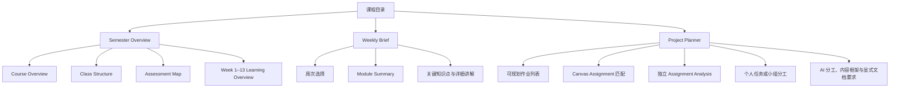
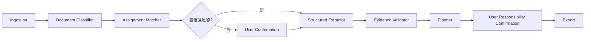

# UniSydneyBuddy Skill Hub — 完整产品文档

- 文档版本：v1.0
- 产品版本：Demo v0.7
- 日期：2026-08-15
- 产品负责人视角：悉尼大学在读学生
- 产品形态：中英双语、本地优先的 AI-ready 课程工作台

## 1. 产品定义

UniSydneyBuddy Skill Hub 将分散在 Unit Outline、Canvas Modules、Lecture、Tutorial / Workshop 和 Assignment Brief 中的课程信息，整理成三个学生可直接使用的工作区：

1. **Semester Overview**：理解课程形式、Assessment 和 Week 1–13 学习路径。
2. **Weekly Brief**：按周总结已发布 Canvas Module，展示 Module Summary、关键知识点与详细讲解。
3. **Project Planner**：从 Canvas 已同步的作业列表进入独立 Assignment Analysis 页面，并生成个人或小组项目计划。

产品不替代 Canvas，也不承担教学问答、论文代写或自动提交。其价值在于把“课程资料”转化为“可核对、可执行、可协作的计划”。

## 2. 用户问题

### 2.1 开学阶段

- Lecture、Tutorial / Workshop 的入口和要求分散。
- Assessment 名称、占比、截止日期、提交形式缺少统一视图。
- 学生难以快速理解一门课从 Week 1 到 Week 13 的结构。

### 2.2 每周学习阶段

- Module、Lecture、Reading、Ed Lesson 和 Workshop preparation 分布在不同位置。
- 学生需要的是本周行动，而不是另一份材料目录。
- Canvas 尚未发布的内容容易被错误推测。

### 2.3 Assignment 阶段

- 同一课程可能同时包含个人报告、小组项目、展示、反思和考试。
- 小组作业不仅需要 To-do，还需要 Owner、Reviewer、共同节点和提交文件。
- 同一作业可能有 Brief、Rubric 和补充说明等多个文件。
- 多门课程之间的 Canvas 作业与分析状态不能串联。

## 3. 目标用户与 JTBD

目标用户是同时修读多门课程、需要处理中英文术语、个人作业与小组 Assessment 的悉尼大学学生。

| 场景 | Job to Be Done |
|---|---|
| 开学 | 帮我快速看懂课程如何运行、如何评分以及整个学期学什么。 |
| 每周开始 | 告诉我这一周学什么、需要提前完成什么。 |
| 收到 Brief | 告诉我属于哪项作业、交什么、何时交以及如何推进。 |
| 小组成立 | 让所有成员看见 Part、Owner、Reviewer 和共同检查点。 |
| 多文件输入 | 将同一作业的 Brief 与 Rubric 合并，不同作业分别建 Project。 |

## 4. 产品目标与非目标

### 4.1 当前 Demo 目标

- 四门课程均能展示 Course Overview、Class Structure、Assessment Map 和 Week 1–13。
- 中文与英文模式保持相同的信息结构和核心能力。
- 已发布的 Weekly 内容可形成行动 Brief；未发布内容保持未知。
- Project Planner 匹配 Canvas Assignment，点击后进入独立分析页，再由可选大模型生成分工 / 任务、内容框架和显式文档要求。
- Assignment Analysis 状态按课程隔离，并在同一浏览器会话内保持。
- 所有关键演示路径均有自动测试。

### 4.2 非目标

- 不自动登录、批量抓取或持续同步 Canvas、Ed、邮箱。
- 不自动完成、提交或代写受评作业。
- 不对学生成员能力进行自动评价或分配。
- 不上传受保密协议保护的行业数据到外部模型。
- 不在当前 Demo 中提供多用户、云端账户或跨设备同步。
- 不声称当前规则生成器已经调用大语言模型。

## 5. 产品原则

1. **课程事实优先**：事实来自 Unit Outline、Canvas 或 Brief；不确定信息明确标记。
2. **先事实，后建议**：Assessment Map 与系统生成计划分层展示。
3. **主动分析后生成**：未点击“AI 分析此作业”时不展示虚假的解析结果或项目计划。
4. **课程与作业隔离**：状态键由课程代码和 Assignment 共同决定。
5. **学生确认最终责任**：系统建议 Part，不替学生决定真实 Owner。
6. **中文优先、术语保真**：中文模式翻译工作流，保留 Assessment、Lecture、Rubric 等必要原词。
7. **不把规则包装成 AI**：当前确定性能力使用“系统生成”描述；模型能力单独规划。

## 6. 信息架构

全局导航包括：

- 左侧固定学期与四门课程目录。
- 左下角 `中 / EN` 语言切换。
- 主内容区三个标签：学期总览、每周简报、项目计划。

## 7. 功能需求

### 7.1 课程目录

- 所有课程直接可见并可点击，不使用下拉菜单。
- 当前课程使用独立高亮状态。
- 切换课程后，三个主模块同步切换到该课程数据。
- Project 文件、成员和 Part 状态不得同步到其他课程。

### 7.2 Semester Overview

#### Course Overview

- 展示课程定位、学习内容和学习路径。
- 中文模式使用中文解释，课程代码与标准术语保留英文。

#### Class Structure

- 展示 Lecture、Tutorial / Workshop、时间或时长、考勤要求。
- 信息缺失时显示“以个人课表为准”或“当前资料未注明”，不得省略整个模块。

#### Assessment Map

- 统一表格展示 Assessment、类型、占比、截止日期和 Deliverables。
- 中文日期格式为 `YYYY年M月D日`；英文为 `D Mon YYYY`。
- 个人、小组、考试、参与和测试等类型必须保持来源含义。

#### Learning Overview

- 连续展示 Week 1–13，不使用逐周折叠菜单。
- 展示每周主题、Lecture、Tutorial 和 Learning Outcomes。
- 未公布 Tutorial 或准备任务显示为未知，不生成合理但无来源的内容。

### 7.3 Weekly Brief

- 周次选择与周标题位于同一行，支持 Week 1–13。
- 当前阶段只处理 Canvas Module；Recording、Ed Lesson、Lecture、Tutorial / Workshop 不进入 Weekly Brief。
- 汇总该周所有可读取 Module Page 正文，不只读取第一项或第一段。
- AI 输出固定为：Module Summary、关键知识点、详细讲解。
- 关键知识点必须解释概念含义及其在本周 Module 中的重要性。
- 详细讲解只解释来源中出现的关系、过程、对比或推理，不添加来源外知识。
- 未主动生成 AI 总结前，可显示 Canvas Module 原文整理与内容目录。
- 未发布 Module 时明确显示空状态，不使用 Unit Outline 推测周内容。

### 7.4 Project Planner

#### A. 可规划作业列表

- 数据来自当前课程 Assessment Map。
- 包含个人与小组作业。
- 排除正式考试、监考测试、Quiz 和 Participation。
- 显示作业名称、类型、占比、截止日期和交付物。
- 已连接 Canvas 时，按标题、Assignment 编号和截止日期匹配同步到的 Assignment。
- 匹配成功后显示 Canvas 状态；学生点击“打开作业分析”后，系统把 Assignment description 与可见 Rubric 加入对应分析页。
- 作业列表与分析详情互斥显示，分析页提供“返回作业列表”。

#### B. 独立 Assignment Analysis 页面

- 资料直接来自已同步 Canvas Assignment description 与可见 Rubric。
- 页面先展示作业类型、占比、截止日期、小组人数与正式交付物。
- 不再显示文字粘贴、文件上传、资料归类或额外同意复选框。
- API 可用且尚无结果时显示“AI 分析此作业”；该明确按钮动作直接发起分析。
- API 不可用时禁用分析按钮，并说明连接或额度问题。

#### C. Assignment 识别与 Project 分组

- 识别仅在当前课程的可规划作业集合中进行。
- 使用文件名与正文中的 Assignment 标题、编号、Group / Team、Reflection 等信息匹配。
- 多个文件属于同一 Assignment 时合并到同一 Project。
- 文件属于不同 Assignment 时分别创建 Project。
- 无可靠匹配时显示“所属作业待确认”，由学生手动选择；不得强制猜测。

#### D. 生成门槛

未成功解析任何文字或文件时，只显示作业列表、资料入口和说明，不显示：

- 作业解析结果；
- 任务拆解；
- AI 分工、内容框架与文档要求；
- 内容框架与所需文档清单；
- 导出按钮。

#### E. 个人作业模式

- 显示作业基本信息和 Deliverables。
- 生成个人任务拆解：要求核对、资料与分析、初稿、最终 QA。
- Owner 默认为当前用户，不显示小组分工确认。
- 可导出个人作业计划。

#### F. 小组作业模式

- 根据来源显示已知人数范围；未知时标记 `Brief 待确认`。
- 支持 3–6 人场景。
- 按人数生成 Part，并允许选择 Owner 与 Reviewer。
- 未为每个 Part 选择 Owner 时，禁止导出完整小组计划。
- 系统不得根据姓名或背景自动判断成员能力。

#### G. AI 内容解析

- 未配置 API 时只进行本地读取和 Assignment 归类，不生成分工、框架或文档清单。
- “AI 分析此作业”按钮本身是明确的用户发起动作；Canvas 同步不会自动调用模型。
- 模型使用 Structured Outputs 返回 Summary、Work Parts、Content Framework 和 Required Documents。
- 不提供按日期倒排的详细执行计划。

#### H. 内容框架与所需文档

- 解析后生成跨学科的内容框架建议：要求映射、背景问题、证据方法、核心分析、结论建议、限制与引用。
- 文档清单只显示已上传资料中明确“要求”或“建议”使用的文档、数据、模板或辅助材料。
- 每项必须显示级别、用途和来源依据；不显示通用建议文件位置。
- 不创建或下载文档模板；仅保留完整项目计划导出。
- 不默认假设所有课程都需要 Python、EDA、视频或固定时长展示。

### 7.5 中英双语

- 默认中文。
- 切换语言只改变展示，不改变课程事实或 Project 归属。
- 所有核心按钮、提示、计划和模板均提供完整英文版本。
- 英文模板不得通过替换字段名而保留中文正文。
- 用户上传的原文件名保持不变。

## 8. Project Planner 状态模型

| 状态 | 条件 | 页面行为 |
|---|---|---|
| Empty | 当前课程没有匹配的 Canvas Assignment | 显示作业列表并提示先同步课程。 |
| Matched | 作业已匹配 Canvas description / rubric | 显示“打开作业分析”。 |
| Analysis ready | 用户进入独立分析页 | 展示作业事实与 AI 分析入口。 |
| Analysing | 用户点击“AI 分析此作业” | 发送当前作业资料并显示生成状态。 |
| Generated | 当前语言结果已生成 | 展示 Assignment Structure、文档要求与分工。 |
| Course switched | 用户进入另一课程 | 不显示上一课程文件；返回时保持原课程会话状态。 |

## 9. 数据与证据边界

### 9.1 数据来源

- Unit Outline：稳定的课程概览、Assessment、Week 1–13。
- Canvas：当前发布的 Module、准备任务、课程形式和特殊规则。
- Assignment Brief / Rubric：Project 的交付物、人数、评分标准和流程要求。

### 9.2 Unknowns 策略

- 不存在于来源的日期、考勤、组队人数和未发布 Weekly preparation 保持未知。
- 未知值不参与确定性计划计算。
- 来源冲突时保留来源，不静默覆盖。

### 9.3 隐私

- 为支持课程切换后保留解析结果，Canvas Assignment 提取文字会保存在当前本地浏览器会话的 Session State 中；关闭或重启服务后不提供长期恢复。
- `data/private/` 与 `data/uploads/` 不进入 Git。
- 未配置 API 时不向外部模型发送资料。配置 OpenAI API 后，只有用户点击“AI 分析此作业”，当前 Assignment description 与可见 Rubric 才会发送至 OpenAI。
- Canvas 只读连接与 AI 分析保持为两个独立动作：连接 Canvas 不会自动发送课程内容给模型。

## 10. AI / Agent 架构

### 10.1 当前已实现

- 本地文档读取、分类、语言识别、哈希和分段。
- 基于规则的 Assignment 匹配与人工确认兜底。
- Schema、证据对象和确定性质量校验。
- 大模型 Structured Outputs、个人 / 小组任务结构和来源依据。
- Provider-neutral 的结构化抽取接口与私有来源阻断。

### 10.2 当前未实现

- 不内置共享 LLM 服务或额度；仅在用户自行配置有效 API Key 后连接 OpenAI Responses API。
- 没有根据 Brief 正文进行完整 Rubric / Deliverable 结构化抽取。
- 没有 Canvas API、邮件或 Calendar 自动同步。
- 没有跨浏览器、跨设备或长期数据库持久化。

### 10.3 目标 Agent 流程

未来模型只负责受约束的抽取、总结和计划建议；日期、占比、引用完整性、隐私阻断和状态隔离继续由代码校验。

## 11. 成功指标

### 产品指标

- 首次进入后 3 分钟内找到目标课程 Assessment。
- 90% 以上 Canvas Assignment 能按标题、编号与截止日期正确匹配。
- 学生能在 5 分钟内完成小组 Part Owner 确认。
- 关键课程事实来源覆盖率达到 100%。

### 质量指标

- Assessment 权重总计正确。
- 四门课程均覆盖 Week 1–13。
- 中英文核心能力一致。
- 课程与 Assignment 状态零串联。
- 未主动分析时零伪解析结果。
- 自动测试与数据校验全部通过后才发布 Demo。

## 12. 已知限制与风险

| 风险 | 当前控制 | 后续方案 |
|---|---|---|
| Assignment 标题写法差异大 | 规则匹配 + 人工确认 | 接入结构化模型和置信度评估。 |
| 扫描 PDF 无文本 | 显式报错；PNG / JPG 可用本机 OCR | 将 PDF 页面转图后复用 OCR。 |
| 会话关闭后状态消失 | 当前明确限定为 Session | 增加本地数据库或用户账户。 |
| Brief 细节尚未驱动全部建议 | 使用跨学科内容框架 | Rubric / Deliverable 抽取后动态生成。 |
| Canvas 内容变化 | 标记检查日期和 Unknowns | 未来增加授权同步与变更确认。 |
| Streamlit 原生控件存在少量英文 | 核心产品文案双语 | 后续使用自定义前端组件。 |

## 13. 版本路线图

### Phase 1–2 — 当前已实现

- 四课程内容、双语、Week 1–13。
- Canvas Assignment 直达独立 Assignment Analysis 页面。
- “AI 分析此作业”直接触发可选 OpenAI API 解析，无额外复选框。
- 合并后的 Assignment Structure、内容说明、分工与显式文档要求。
- 用户隔离、SQLite 跨会话状态保持、增量同步与人工确认兜底。
- 卡片化 Semester Overview、Module-only Weekly Brief 与同步状态。
- 四课程 AI Evaluation、无正文时明确“资料未同步”和用户结果反馈。

### Phase 3 — 只读 Canvas Connector（当前正式路径）

- Chrome Manifest V3 扩展从用户已登录的 `canvas.sydney.edu.au` 会话调用只读 Canvas REST API。
- 用户主动选择同步课程；读取 Courses、Modules、Pages、Assignments 与 Announcements。
- 本地开发发送到 localhost Bridge；公开版发送到网站生成的私人同步地址。
- 不读取密码、cookie 值、成绩、提交记录、讨论回复或其他学生资料。
- 无 Connector 环境时继续使用脱敏 fixture 与手动粘贴 / 上传。

### Phase 4 — 单一公开部署版本

- Streamlit 网站与 Canvas Sync API 由同一 Blueprint 部署，学生只看到一个产品网站。
- 统一 Course、Module、Assessment、Announcement 与 Source Snapshot，并以内容哈希增量同步。
- AI 结果、用户反馈和同步基线持久化；按匿名用户命名空间隔离。
- 部署细节见 `docs/DEPLOYMENT.md`。

### Phase 5 — 暂不实施

- 当前不申请悉尼大学 Developer Key，不实现 Canvas OAuth。
- 浏览器 Connector 继续作为正式同步路径；详细决策见 `docs/CANVAS_INTEGRATION_DECISION.md`。

### 后续 — Structured Brief Extraction

- 从 Brief / Rubric 抽取真实 Deliverables、评分标准和限制。
- AI 不确定时明确显示资料未同步或无法判断，不强制给每个知识点显示来源定位。
- 根据不同 Assignment 动态生成内容框架和文档清单。

### 后续 — Course Update Workflow

- 粘贴 Announcement / Email。
- Before / After 差异与用户确认。
- 更新 Weekly Brief 和 Project Milestones。

### v1.0 — 可用产品

- 用户授权的课程资料同步。
- 本地或受控云端持久化。
- 日历集成、可编辑计划和团队共享。
- 可观测的 Agent trace、成本、延迟与质量 Eval。

## 14. Demo 验收口径

Demo 被视为可交付，需要同时满足：

1. 四门课程均可点击，Course Overview、Class Structure、Assessment Map、Week 1–13 正常。
2. Weekly Brief Week 1–13 均可选择，未发布内容不被生成。
3. 中文与英文核心功能一致。
4. 多文件可创建多个 Project，同 Assignment 文件可合并。
5. 不确定 Assignment 必须人工确认。
6. 个人与小组作业呈现合理差异。
7. 课程切换不串文件，返回后保持原状态。
8. 未上传时不显示解析结果。
9. 所有下载内容独立有效。
10. 自动测试、数据校验、依赖检查、编译和真实浏览器验收均通过。
